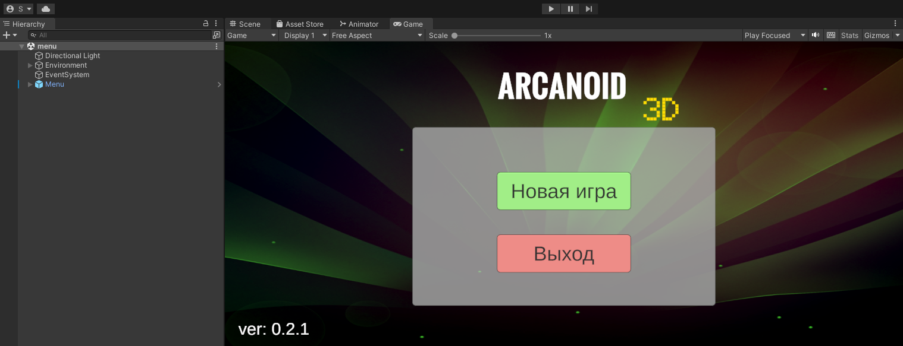
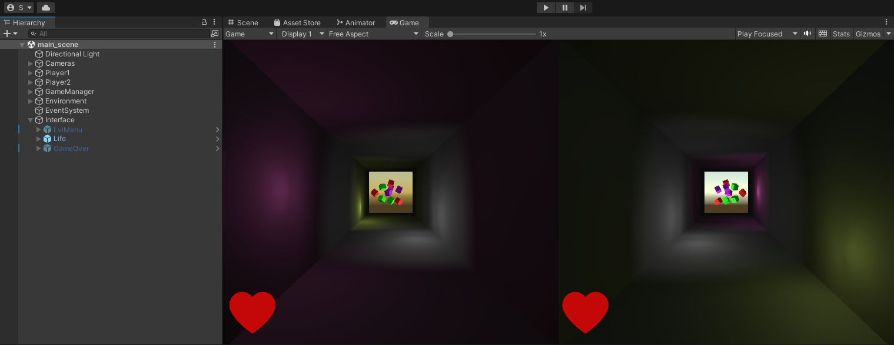
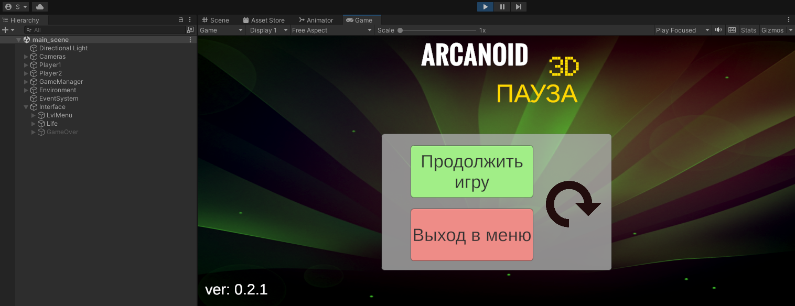

# arcanoid3d_prototype
Проект: Прототип игры Арканоид.
Unity 2021.3.18
Основные реализованные моменты: 
- 2 игрока, сплит система экрана, управление реализовано через новую система ввода (1-WASD, 2-стрелки);
- разрушаемые блоки, которые расположенны в центре тоннеля;
- мяч, запускается всегда первым игроком (через клавишу пробел), и который отражается от стен, блоков и платформ игроков через Vector3.Reflect;
- счетчик жизней общий.

Update 09/05 :
- обновлена сплит система экрана (1 display);
- добавлена сцена меню;
- добавлена меню-пауза в самой игре (необходимо нажать ESC).
<table>
    <tr>
        <td>
            
        </td>
    </tr>
    <tr>
        <td>
            
        </td>
    </tr>
    <tr>
        <td>
            
        </td>
    </tr>
    <tr>
        <td>
            
        </td>
    </tr>
</table> 
